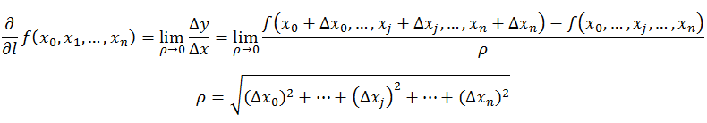
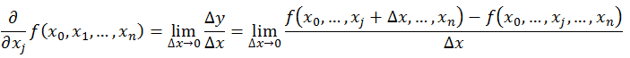
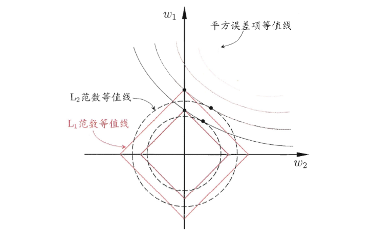
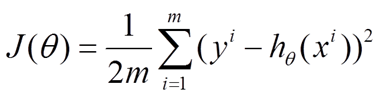
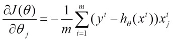
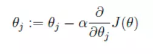
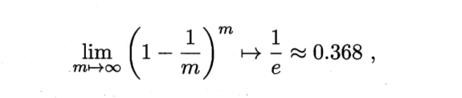
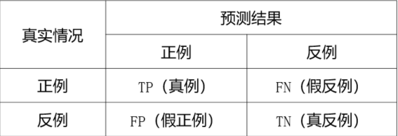
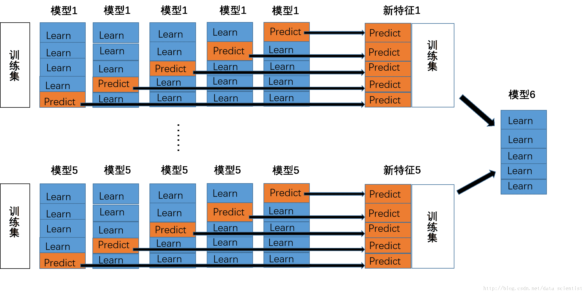
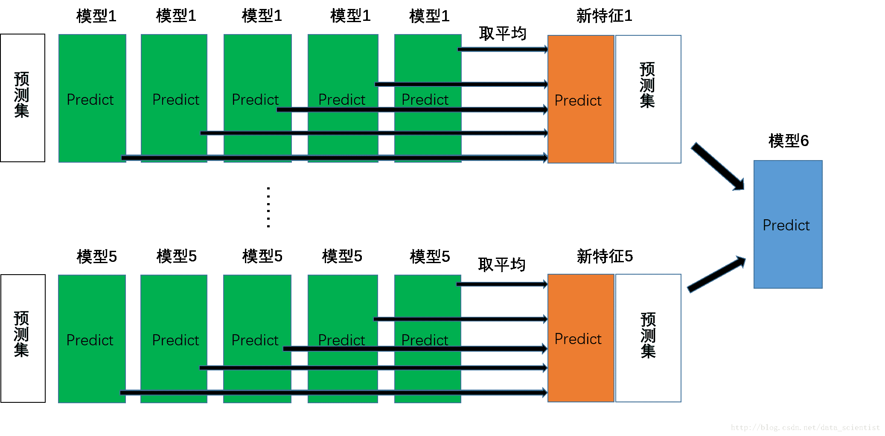

##  缺失处理

### 数据缺失及其类别

- 完全随机缺失： 
  当某变量缺失值发生的可能性与其他变量无关也与该变量自身无关时称作MCAR。换句话说，某变量缺失值的出现完全是个随机事件。可以将存在MCAR变量的数据看做是假定完整数据的一个随机样本
  例如，由于测量设备出故障导致某些值缺失。
- 随机缺失： 
  当某变量出现缺失值的可能性与模型中某些观测变量有关而与该变量自身无关时称作MAR
  例如，在一次测试中，如果IQ达不到最低要求的100分，那么将不能参加随后的人格测验。在人格测验上因为IQ低于100分而产生的缺失值为MAR
- 非随机缺失：  
  当某变量出现缺失值的可能性只与自身相关时称作MANR
  例如，公司新录用了20名员工，由于6名员工表现较差在试用期内辞退，试用期结束后的表现评定中，辞退的6名员工的表现分即为非随机缺失。

### 数据缺失的处理方法

- 删除法：当一条记录中存在许多缺失时，将记录删去；当一个列存在许多缺失时，将列删去。或将特征映射到高维，对特征的每个属性做是否判断。或添加缺失项这一特征
- 均值替代法：使用每个变量的均值去填补该变量的缺失值。这种方法容易产生估计偏差。
- 回归法 ：根据变量间的相关，利用其他变量的信息通过建立回归方式去推算缺失值。该法同样会产生估计偏差。
- 期望值最大化（Expectation Maximization, EM）法：随机缺失的条件下，假设模型对于完整的样本是正确的，那么通过观测数据的边际分布可以对未知参数进行极大似然估计。这种方法也被称为忽略缺失值的极大似然估计，对于极大似然的参数估计实际中常采用的计算方法是期望值最大化。
- K最近距离邻（K-means clustering）法：先确定距离具有缺失数据样本最近的K个样本，将这K个值加权平均来估计该样本的缺失数据。
- 不处理：把缺失当成一种特殊值。
- 拉格朗日插值法

拉格朗日插值法，即对于点 $(x_1,y_1),(x_2,y_2),(x_3,y_3)$
存在曲线经过这些点，运用线代中的坐标基向量的找法，该多项式曲线为 
$$
f(x)=y_1f_1(x)+y_2f_2(x)+y_3f_3(x)+...
$$

其中$f_i(x_j)= \begin{cases} 1, & \text {i=j}   \\ 0 , & \text{i!=j}	\end{cases} $

推导有 $ f_i(x)=\prod \cfrac{x-x_i}{x_i-x_j}  $

## 特征选择

### 特征选择的方法

前向选择法：在前一轮产生的最优特征集合上，添加这一轮的最优特征，且产生的特征集合优于上一轮。若在K+1轮时，最优的{K+1}特征集合表现不如上一轮的K个特征集，则停止搜索。
后向选择法：类似前向，前向选择和后向选择都属于贪心策略，仅考虑本轮的最优。对于特征选择方法，可以基于决策树算法，选取信息增益最大的特征。
过滤式选择：先进行特征选取，特征的选取依据一种相关统计量来度量，类似于距离度量。然后再训练学习器。
包裹式选择：将最终确定的学习器性能作为特征选择的评价准则。
嵌入式选择：将特征选择和学习器训练过程融为一体，即在损失函数中，为避免样本特征多，样本量少，产生的过拟合，引入正则化项，其中L1范数更容易获得稀疏解

### 多重共线性检测

使用方差膨胀因子(VIF)来鉴定，如果VIF大于5，则说明变量存在多重共线性。一旦发现变量之间存在多重共线性的话，可以考虑删除变量和重新选择模型（岭回归法）

$VIF =\cfrac{1}{1-R^2}$
$R^2是以x_j$为因变量时对其它自变量回归的复测定系数

`from statsmodels.stats.outliers_influence import variance_inflation_factor`
`variance_inflation_factor(data.values, index of the variable in the columns)`

### 缺失值处理

`fancyimpute 支持填充方法删除法、均值法、回归法、KNN、MICE、EM等`

## 统计知识

### 假设检验
对总体参数做一个尝试性的假设，来确定是否应拒绝总体参数值

1.假设检验中的两类错误

> 第一类错误：原假设为真，拒绝原假设
> 第二类错误：备择假设为真，不拒绝原假设

2.显著性水平：犯第一类错误的概率

3.下侧检验：拒绝域出现在下侧
$$
原假设：H_0:u≥u_0  

备择假设：H_a:u＜u_0
$$
4.上侧检验：拒绝域出现在上侧
$$
原假设：H_0:u≤u_0  

备择假设：H_a:u＞u_0
$$
总体方差$\sigma^2$ 已知的情况下：Z检验
总体方差$\sigma^2$ 未知的情况下：t检验

5.p值：概率值，是样本所提供的证据对原假设支持程度的度量，p越小，表明反对原假设的证据越多,p大于显著性水平时，不拒绝原假设

### 自由度

- wiki解释

　　**在统计学中，自由度（英语：degree of freedom, df）是指当以样本的统计量来估计总体的参数时，样本中独立或能自由变化的数据的个数，称为该统计量的自由度[1]。一般来说，自由度等于独立变量减掉其衍生量数[2]；举例来说，方差的定义是样本减平均值的平方之和（一个由样本决定的衍生量），因此对N个随机样本而言，其自由度为N-1。**  

　　**估计总体的方差时所使用的统计量是样本的方差 s，而 s必须用到样本平均数x来计算。 x在抽样完成后已确定，所以大小为 n的样本中只要  n-1个数确定了，第 n个数就只有一个能使样本符合x的数值。也就是说，样本中只有  n-1个数可以自由变化，只要确定了这  n-1个数，方差也就确定了。这里，平均数 x就相当于一个限制条件，由于加了这个限制条件，样本方差 s的自由度为 n-1。**

### 中心极限定理
若给定样本量的所有样本来自任意总体，则**样本均值的抽样分布近似服从正态分布**，样本量越大，近似性越强

### 方差和标准差
样本方差$$ s^2$$是对总体方差$$ \sigma ^2$$的无偏估计

### Pearson相关系数

两个变量之间是线性关系，总体是正态分布
$  r=\cfrac{\sum (X-\overline{X})(Y-\overline{Y})}{\sqrt{\sum (X-\overline X})^2 \sqrt{\sum (Y-\overline Y})^2} $

### 超几何分布

N中有M个特定种类，抽取n个时，会有k个特定种类的概率

### 导数

导数，指的是一元函数中，函数y=f(x)在某一点处沿x轴正方向的变化率； 

### 方向导数

方向导数的定义，即：某一点在某一趋近方向上的变化率，就是函数在其他特定方向上的变化率

### 偏导数

偏导数，指的是多元函数中，函数y=f(x1,x2,…,xn)在某一点处沿某一坐标轴（x1,x2,…,xn）正方向的变化率。 

　

### 梯度

梯度为解决空间中的某点，沿着哪个方向有最大的变化率
$$gradf(x_0,x_1,...,x_n)=(\cfrac{\delta{f}}{\delta{x_0}},...,\cfrac{\delta{f}}{\delta{x_n}}) $$
既有
1.梯度是一个向量，即有方向有大小； 
2.梯度的方向是最大方向导数的方向； 
3.梯度的值是最大方向导数的值。 

### 泰勒公式

$$ 若f(x)在a点处n+1可导，那么函数在a处的泰勒展开式 $$

$$ f(x)=f(a)+\cfrac{f'(a)}{1!}(x-a)+\cfrac{f^{(2)}(a)}{2!}(x-a)^2+..+\cfrac{f^{(n)}(a)}{n!}(x-a)^n+R_n $$
其中$$ R_n $$是泰勒公式的余项，是$$ (x-a)^n $$的高阶无穷小

### 仿射

任意两点$$X_1,X_2 \in K 以及 \alpha \in R$$，这两点连线上的所有点$$ \alpha X_1+(1-\alpha)X_2 \in K $$,则称这些点为仿射组合

### 仿射函数

仿射函数即由 1 阶多项式构成的函数，一般形式为 f (x) = A x + b，这里，A 是一个 m×k 矩阵，x 是一个 k 向量，b 是一个 m 向量，实际上反映了一种从 k 维到 m 维的空间映射关系

### 超平面

超平面H是从n维空间到n-1维空间的一个映射子空间，它有一个n维向量和一个实数定义。因为是子空间，所以超平面一定过原点，二维空间里的超平面为一条直线. 一维空间里超平面为数轴上的一个点。

### 凸集
K是n维欧式空间一点集合，若任意两点$$X_1,X_2 \in K$$，这两点连线上的所有点$$ \alpha X_1+(1-\alpha)X_2 \in K ,(0 \leq\alpha\leq1)$$,则称$$K$$为凸集

### 凸函数

定义在某个向量空间的凸子集区间上的实值函数，对于任意两点$$x,y,以及t \in [0,1]$$，有
$ f(tx+(1-t)y) \leq tf(x)+(1-t)f(y) $，也就是凸函数上任意两点的连线都在两点区间的函数之上   

凸函数的性质：
> 1.凸函数的epigraph（函数图上或上方的点集合）为凸集
> 2.对于$$∀x,y，f(y)≥f(x)+∇f(x)^T(y−x) $$,即在函数某点切线上的点的值小于该点在函数上的值
> 3.对于$$∀x∈dom(f)， ∇^2f(x)≥0$$, 函数图像在定义域中每点处均有向上的正弯曲
> 4.凸函数的任何 极小值都是最小值，严格凸函数最多有一个最小值
> 5.凸函数具有仿射不变性，即f(x)是凸函数，则g(y)=f(Ax+b)也是凸函数

### 凸优化

> 1.目标函数必须是凸的
> 2.不等式约束函数必须是凸的
> 3.等式约束函数必须是仿射的

### 最大似然估计

概率是已知模型和参数，推数据。统计是已知数据，推模型和参数。最大似然估计的目的就是：利用已知的样本结果，反推最有可能（最大概率）导致这样结果的参数值。

对于P(x|θ)，x表示某一个具体的数据；θ表示模型的参数。

如果θ是已知确定的，x是变量，这个函数叫做概率函数(probability function)，它描述对于不同的样本点x，其出现概率是多少。

如果x是已知确定的，θ是变量，这个函数叫做似然函数(likelihood function), 它描述对于不同的模型参数，出现x这个样本点的概率是多少。

### 对数几率

一个事件发生的概率与不发生的概率的比值称为几率
对数几率函数为 $$ logit(P)=log(\cfrac{P}{1-P})=\beta_0+\beta_1x_1+...+\beta_nx_n$$,与逻辑回归函数转化

## 线性代数1

### 二维空间的向量

可以由两个基向量$ \vec{i}=\left[ \begin{array}{ccc}1\\0
\end{array}\right]
,\vec{j}=\left[ \begin{array}{ccc}0\\1
\end{array}\right]
 $，经过向量数乘和向量加法运算后表示
$\left[ \begin{array}{ccc}
-3\\
2
\end{array}\right]
=-3\vec{i}+2\vec{j}$
向量空间的一组基是张成该空间的一个线性无关向量集，当选择不同的基向量时，获得一个新的坐标系

### 线性组合

两个数乘向量的和被称为这两个向量的线性组合
$a\vec{v}+b\vec{w},即\vec{v}和\vec{w}的线性组合，构成的向量集合称为张成的空间$
当固定其中一个标量，让另一个标量自由变化，所产生的向量的终点会描出一条直线；
当两个标量同时自由变化（非零向量；不共线的情况下），可以获得所有的二维向量

### 线性变换
接受一个向量并且输出一个向量的变换

线性变换的特性：
1.直线依旧是直线；
2.原点保持固定

考虑基向量线性变换后的位置，其他向量通过变换后基向量表示变换值
变换后的基向量
$$
\vec{i}=\left[ \begin{array}{ccc}1\\-2
\end{array}\right]
,\vec{j}=\left[ \begin{array}{ccc}3\\0
\end{array}\right]
，则变换后的
\vec{v}=-3\vec{i}+2\vec{j}=\left[ \begin{array}{ccc}
-3*1+2*3\\
-3*-2+2*0
\end{array}\right]
$$

### 矩阵乘法和线性变换

$$
A=\left[ \begin{array}{ccc}i,j
\end{array}\right]=\left[ \begin{array}{ccc}1 & 3\\-2 & 0
\end{array}\right]是变换后的基向量，\left[ \begin{array}{ccc}x \\y
\end{array}\right] 是任意初始向量，则A\left[ \begin{array}{ccc}x \\y
\end{array}\right]为线性变换后的向量
$$

## 线性代数2

### 矩阵乘法和线性变换(续)

两个矩阵相乘的几何意义，就是两次线性变换的相继作用
$AB \begin{bmatrix} x \\ y \end{bmatrix}=C \begin{bmatrix} x \\y \end{bmatrix}$

### 行列式

矩阵A的行列式$det(A)=M$,表示将一个区域的面积变换为原来的M倍，若M为0，则表示线性变换将平面压缩成一条线或者是一个点。即通过判断行列式是否为0，确定矩阵所代表的线性变换是否将空间压缩，降维 

### 线性方程组

对于求解线性方程组$ A\vec{x}=\vec{v},即是找到一个向量\vec{x}，在经过矩阵A线性变换后，与\vec{v}重合$

### 逆矩阵
对于$A^{-1}A=E$的恒等变换 ，只存在于det(A)≠0，即若矩阵A代表的线性变换将空间压缩，则无法通过逆变换还原

### 秩

代表着线性变换后空间的维数，当列数与秩相等时，称为满秩

### 向量的点积

向量的点积$$ \vec{v}*\vec{w}=\vec{v}的投影长度*\vec{w}的长度=\vec{v}*\vec{w}的投影长度 $$

对偶性:两种数学事物之间自然而又出乎意料的对应关系

### 向量的叉积

$ \vec{v}\times\vec{w}=\vec{p},其中\vec{p}的长度等于平行四边形的面积，方向垂直于\vec{v}和\vec{w} $

## 线性代数3

### 不同坐标系下的基向量

A坐标系下基向量$$ \vec{i},\vec{j} $$，B坐标系下基向量$$ \vec{b_1},\vec{b_2} 为\left[ \begin{array}{ccc}0 \\1
\end{array}\right] 和\left[ \begin{array}{ccc}1 \\0
\end{array}\right] $$，其中从A的视角中，$$ \vec{b_1}=\left[ \begin{array}{ccc}2 \\1
\end{array}\right],\vec{b_2}=\left[ \begin{array}{ccc}-1 \\1
\end{array}\right] $$，这两个坐标系都共用一个原点，但是坐标轴的方向和网格间距会不同，这依赖与对基的选择

令$$ M=\left[ \begin{array}{ccc}2 & -1 \\1 &1
\end{array}\right]$$,对于两种坐标系下的向量转换，即存在$$ M\alpha=\beta $$,其中 $$ \alpha=\left[ \begin{array}{ccc}1 & 0 \\0 &1
\end{array}\right] $$ 为B坐标系视角下的向量，$$ \beta=\left[ \begin{array}{ccc} \vec{b_1} & \vec{b_2}
\end{array}\right]  $$为A坐标系视角下的向量。

推广下，则有
$  M^{-1}PM\alpha 代表在两种坐标系视角下，经过矩阵P(A视角下)的线性变换后，获得的B视角下的向量 $

### 特征向量

对于线性变化A，若存在原向量$ \alpha $,经过A变化后，仍在其张成的空间中，只做拉伸变化，即存在
$ A\alpha=\lambda\alpha $，其中$ \lambda $为拉伸或压缩比例因子，称向量$ \alpha为特征向量，\lambda为特征值 $

特征向量的用途：在一个三维空间旋转中，对于旋转的特征向量，可以将此特征向量视为旋转轴，此时特征值为1

### 特征基

当特征向量可作为基向量时，即$$ \vec{b_1},\vec{b_2} $$ 为P变换中的特征向量，则有
$$ M^{-1}PM 为新基的视角下P变换，所得到的矩阵，这个矩阵为对角矩阵，对角元为特征值，其中M为P变化的特征向量，这是因为在所处的坐标系的基向量在变换中只进行了伸缩  $$

### 正交矩阵

矩阵的逆和矩阵的转置相等

### 正定矩阵

对任意非零向量$$  \vec{x},有x^TAx>0 $$,即称A为正定矩阵，且A的特征值均为正；
正定、半正定矩阵的直觉代表一个向量经过它的变化后的向量与其本身的夹角小于等于90度。

### 二次型矩阵

二次型矩阵具有对称性，所以二次型一定可以化成对角矩阵

### 相似对角化

如果矩阵与一个对角阵相似，那么他们具有相同的特征多项值、特征值、秩
一个矩阵 $$A=\lambda_1P_1+\lambda_2P_2+... $$
其中，$$ P称为A的谱族，\lambda为特征值,特征值
和谱族的乘积就代表了它对矩阵A 的贡献率,即能量（power）或者权重
(weight)。这样，能量多的、权重大的部分当然重要，问题的主要矛盾就凸显出来了 $$
对于矩阵$$A=P\left[ \begin{array}{ccc}\lambda_1 &  \\ & \lambda_2
\end{array}\right]P^{-1}，其中P=[p_1,p_2,..],P^{-1}=[q_1,q_2,..]^T,则有P_1=p_1q_1,...$$,

## 线性回归方程

> 简单线性回归模型

$$
y=β_0 + β_1 X + ε
$$

ε 是一个随机变量，称为模型的误差项，即不能被x，y之间的线性关系解释的变异性

> 简单线性回归方程

$$
E(y)=β_0 + β_1 X
$$

> 估计的简单线性回归方程

$$
\hat{y}=b_0 + b_1 X
$$

用样本统计量 $$ b_0 + b_1 X $$ 替代回归方程中的未知参数

> 最小二乘法准则   

最小二乘法是利用样本数据，通过使应变量的观测值$$ y_i $$与应变量的预测值 $$\hat{y}$$ 之间的离差平方和达到最小的方法求得 $$ b_0 和 b_1  $$ 
$$
min\Sigma(y_i-\hat{y})^2
$$

> 判定系数
> 为估计回归方程提供一个拟合优度的度量  

1.离差$ y_i -\hat{y} $$ 表示用方程的估计值预测所产生的误差，称为误差平方和 $$  SSE=\Sigma(y_i -\hat{y})^2 $

2.离差$  y_i -\bar{y} $$ 表示用样本平均值来去预测所产生的误差，称为总平方和 $$ SST=\Sigma(y_i -\bar{y})^2 $

3.离差$  \hat{y} -\bar{y} $ ，称为回归平方和 $ SSR=\Sigma(\hat{y} -\bar{y})^2 $

4.$SST=SSR+SSE$

5.判定系数：$ r^2= \frac {SSR} {SST} $

6.仅仅依靠判定系数，无法判断x和y之间的显著性，只能判断最小二乘回归直线是否很好的拟合了样本数据

> 相关系数   
> $  r_{xy}=（b_1的符号)\sqrt{判定系数} $   
> 样本相关系数被限制在两变量之间存在线性关系的情况

### 显著性检验

关于简单线性回归模型中误差项ε的假定
$$
y=β_0 + β_1 X + ε
$$
1.误差项ε是一个期望值为零的随机变量，即$E(y)=0$,
即有 $E(y)=β_0 + β_1 X$

2.对所有的x值，ε的方差$\sigma^2 $相同

3.ε值是独立的，且符合正态分布

4.假设检验，判定$β_1$ 是否为0

$\sigma^2 $的估计：$ s^2=MSE=\frac{SSE} {n-2} $

### 损失函数

最小二乘法的拟合误差函数：
$ loss=\Sigma(y_i-\hat{y})^2=\Sigma(y_i-β_0 - β_1 X)^2 $
损失函数：
$ Loss function= Fit Error + Model Complexity $
其中复杂度代价函数就是约束我们的模型尽量的简单，模型越复杂，规则化值越大

>范数

范数，是具有“长度”概念的函数。
L1范数对应曼哈顿距离
L2范数对应欧式距离

> L0范数

向量中非零元素的个数

> L1范数 (Lasso regularization) 

$ ||x||_1 = \sum_{i=1}^N|x_i| $，即向量元素绝对值之和
L1正则化有助于生成一个稀疏的权值矩阵，即使线性回归模型中大多数系数为0
损失函数：
$ J=J_0+\alpha\sum|w| $
其中$J_0为原始的损失函数，\alpha为正则化系数 $

> L2范数 (Ridge Regression)

$ ||x||_2 = \sqrt[2]{\sum_{i=1}^N|x_i^2|} $，即向量元素绝对值平方和的开平方

**L1范数和L2范数正则化都有助于降低过拟合风险，但前者更易于获得更少的非零向量。即L1会趋向于产生少量的特征，而其他的特征都是0，而L2会选择更多的特征，这些特征都会接近于0**

如图，假定x仅有两个属性，此时L1范数等值线和平方误差等值线交点更常出现在坐标轴上，即参数为0的情况

### 参数优化

机器学习的参数估计，是寻找最优参数使得损失函数最小化。在理想的情况下，损失函数是凸的、连续的、可导的。因此最基本的优化算法有：

> 梯度下降法(Gradient Descend Method)：     

梯度下降法，用当前负梯度的方向作为搜索方向，梯度下降法算法用梯度乘以一个称为学习速率（有时也称为步长）的标量，以确定下一个点的位置
对于损失函数$$J(\theta) $$,其中m为样本个数,对$$\theta $$求导，

> 批量梯度下降法(BGD)

对于BGD法，每次迭代需要把m个样本全部带入计算，可以得到全局最优解，但会导致计算量庞大

> 随机梯度下降法(SGD)

在更新每一参数时都使用一个样本来进行更新，也就是m等于1。每一次跟新参数都用一个样本。最终的结果往往是在全局最优解附近，适用于大规模训练样本

> 小批量梯度下降

是介于全批量迭代与 SGD 之间的折衷方案。小批量通常包含 10-1000 个随机选择的样本。小批量 SGD 可以减少 SGD 中的杂乱样本数量，但仍然比全批量更高效

> 牛顿法和拟牛顿法： 

由$$f(x)在x_k点处的$$泰勒公式推展，对于极小值点有$$ f'(x)=0 $$,既有$$x=x_k-\cfrac{f'(x_k)}{f''(x_k)}$$,即需要求值$$ d_k=-\cfrac{f'(x_k)}{f''(x_k)} $$,令$ x_{k+1}=x_k+d_k $,重新迭代计算

梯度下降使用梯度(一阶导数)寻找下降最快的方向，而牛顿法通过曲率(二阶导数)寻找下降最快的方向，因此牛顿法的路径更直接。

> 共轭梯度法：             

介于最速下降法与牛顿法之间的一个方法，仅需一阶导数信息

## 逻辑回归

### logistic函数
$𝑓(𝑥)=\cfrac{𝑒𝑥𝑝(𝑥)}{1+exp⁡(𝑥)}$

函数特点:

>单调递增
0＜f(x)＜1
处处可导
$𝑓^′ (𝑥)=𝑓(𝑥)(1−𝑓(𝑥))$

### 逻辑回归模型

(回归模型是对概率做回归，而非对结果做回归)：
$ p(Y=1|x)=\cfrac{𝑒𝑥𝑝(\beta𝑥)}{1+exp⁡(\beta𝑥)}$
$ p(Y=0|x)=\cfrac{1}{1+exp⁡(\beta𝑥)}$
$ P(Y_i=y_i)=p(Y=1|x)^{y_i}p(Y=0|x)^{1-y_i} $

### 参数优化
（极大似然法MLE）

似然函数为：

$ L(x,y|\beta)=\prod_{i=1}^N[p(Y=1|x)^{y_i}][p(Y=0|x)^{1-y_i}] $

对数似然函数为：
$ LL(x,y|\beta)=\sum_{i=1}^N[y_ilog(\cfrac{e^{\beta x}}{1+e^{\beta x}})+(1-y_i)log(\cfrac{1}{1+e^{\beta x}})]=\sum_{i=1}^N[y_i(\beta x_i)-log(1+exp(\beta x_i))] $

为使函数实现最大值，可采用梯度上升法，

$ \cfrac{\partial LL(x,y|\beta)}{\partial \beta_i}=\sum_{i=1}^N[y_ix_i-x_i\cfrac{exp(x_i\beta)}{1+exp(x_i\beta)}] $

$ \beta^{i+1}=\beta^{i}+\nabla*h $ (h为步长)

最优的参数值即为 
$ \beta=\sum\nabla_i*h_i $

对于多分类情况，借用softmax函数，或者通过多个二分类实现

### 模型特点
模型的结果是估计出属于某一类的概率；
变量之间是线性可加关系；
可增量式读取数据；
需要对非数值变量进行编码；
对缺失值敏感，需要处理；
对异常值敏感，需要处理；
需要做变量归一化；
变量的线性相关性对模型有影响，需要变量挑选和正则化；

## 模型评估

### 训练集与测试集的划分方法

- 留出法

将数据集D划分为两个互斥的集合，一个作为训练集S，一个作为测试集T，满足D=S∪T且S∩T=∅，常见的划分为：大约2/3-4/5的样本用作训练，剩下的用作测试。训练/测试集的划分要尽可能保持数据分布的一致性，以避免由于分布的差异引入额外的偏差，常见的做法是采取分层抽样。同时，由于划分的随机性，单次的留出法结果往往不够稳定，一般要采用若干次随机划分，重复实验取平均值的做法。

- 交叉验证法

交叉验证法的思想是：每次用k-1个子集的并集作为训练集，余下的那个子集作为测试集，这样就有K种训练集/测试集划分的情况，从而可进行k次训练和测试，最终返回k次测试结果的均值。交叉验证法也称“k折交叉验证”，k最常用的取值是10

- 自助法(bootstrapping)

对于含m个样本的数据集，开始有放回的抽取m次,作为训练集,然后把数据集和训练集的差集作为测试集，其中样本不被抽到的概率为

### 度量标准
衡量模型泛化能力的评价标准

- 错误率和精度
- 查准率（precision）和查全率（recall）

模型总体判断准确率
$$ Accuracy=\cfrac{TP+TN}{TP+TN+FP+FN} $$

查准率
$$ Precision=\cfrac{TP}{TP+FP} $$

查全率
$$ Recall=\cfrac{TP}{TP+FN} $$

查准和查全是一对矛盾的度量，查准率-查全率曲线，简称P-R曲线。
$ F_\beta=\cfrac{(1+\beta^2) \times P \times R}{(\beta^2 \times P)+R} $ 表达了查准率/查全率 的不同偏好，采用调和平均值，调和平均更重视较小值。其中 $\beta>1$时查全率有更大的影响，小于1时查准率有更大影响

### ROC和AUC

ROC曲线是多个混淆矩阵的结果组合，如果在上述模型中我们没有定好阈值，而是将模型预测概率从高到低排序，将每个概率值依次作为阈值，那么就有多个混淆矩阵。
对于每个混淆矩阵，我们计算两个指标

$$纵轴TPR（True positive rate）= TPR=\frac{TP}{(TP+FN)}=Recall$$
$$横轴FPR（False positive rate）=\frac{FP}{(FP+TN)}$$

因此，ROC曲线越接近左上角，该分类器的性能越好。

AUC的值为ROC曲线下面的面积，一般AUC均在0.5到1之间，AUC越高，模型的区分能力越好，若AUC=0.5，表示模型的区分能力与随机猜测没有差别

## K近邻算法

### 算法原理
存在一个训练样本集，并且样本集中每个数据都存在标签。输入没有标签的新数据后，将新数据的每个特征与样本集中数据对应的特征进行比较，然后算法提取样本集中特征最相似数据（最近邻）的分类标签。一般来说，我们只选择样本数据集中前k个最相似的数据，这就是k-近邻算法中k的出处，通常k是不大于20的整数。最后，选择k个最相似数据中出现次数最多的分类，作为新数据的分类。

### kNN算法之KD树（K-dimension tree）
KD树建树采用的是计算n个特征的取值的方差，用方差最大的特征值来作为根节点，该特征下的中位数作为划分点，对于所有第k维特征的取值小于划分点的样本，我们划入左子树，对于第k维特征的取值大于等于划分点的样本，我们划入右子树，对于左子树和右子树，我们采用和刚才同样的办法来找方差最大的特征来做更节点，递归的生成KD树。

### KNN的主要优点：
可用于分类和回归；
复杂度比SVM低；
适用样本量大的分类；

### KNN的主要缺点：
特征数多时，计算量大；
可解释性不强

## K-means算法

### 算法原理

聚类是一种无监督的学习，它将相似的对象归到同一个簇中，簇内的对象越相似，聚类的效果越好。K-均值（K-means）聚类的算法是将k个不同的簇，且每个簇的中心采用簇中所含值的均值计算而成。
K-means算法：创建k个点作为起始质心（经常是随机选择），计算质心与每个数据点之间的距离，根据距离形成K个簇，重新计算K个簇的质心，形成新的簇，重复迭代计算，直至质心不变

### 距离度量

基本性质：
非负性 $$ dist(x_i,x_j)≥0 $$
同一性 $$ dist(x_i,x_j)=0 当且仅当 x_i=x_j$$
对称性 $$ dist(x_i,x_j)=dist(x_j,x_i) $$
直递性 $$ dist(x_i,x_j)≤ dist(x_i,x_k)+dist(x_k,x_j) $$

- 闵可夫斯基距离

$$ dist(X_i,X_j)=(\Sigma |X_{ik}-X_{jk}|^P)^{\frac{1}{P}} $$

- 欧几里得距离（p=2时）

$$ dist(X_i,X_j)= \sqrt[2]{\Sigma|X_{ik}-X_{jk}|^2} $$

- 曼哈顿距离（p=1时）

$$ dist(X_i,X_j)= \Sigma|X_{ik}-X_{jk}| $$

- 无序属性采用VDM距离

## 聚类

1.K均值，基于原型的、划分的聚类技术，直至满足指定个数的簇
2.凝聚层次聚类，开始每个点作为簇，然后重复合并最近的簇，直至产生预设的簇个数
3.分裂层次聚类，从包含所有点的某个簇开始，每一步分裂一个簇，直至产生预设的簇个数
4.DBSCAN，基于密度的聚类算法，簇的个数由算法自动确定，低密度区域的点视为噪声而忽略，因此不会产生完全聚类

K-means算法对离群点敏感（需要进行离群点检测），不能处理非球形簇，不同尺寸，不同密度的簇。仅限于具有中心（质心）概念的数据。K-中心点可以弥补受离群点的影响

二分K均值
将所有集合分成两个簇，选取一个簇进行分裂，直到产生K个簇

### 簇度量

1.簇的非监督度量分成两类：簇的凝聚性来度量确定簇中对象如何密切相关，簇的分离性度量确定某个簇不同于其他簇的地方
2.簇的监督度量簇标号与标号的匹配程度

### 轮廓系数（结合凝聚度和分离度两种因素）

1.某个点到簇中其他点的平均距离a
2.某个点到其他簇中点的距离b
3.某点的轮廓系数$ s=\cfrac{b-a}{max[a,b]} $

## 神经网络

前馈神经网络是由一层一层构建的，涉及到输入层，隐藏层（中间层），输出层，每层的关系可以由公式$$ \vec{y}=f(w\vec{x}+b) $$ 表示，其中 f为激活函数，常用Sigmod函数表示。即可以理解为每层之间的信息的传递是通过线形变换和非线性变换。增加节点数：增加维度，即增加线性转换能力。增加层数：增加激活函数的次数，即增加非线性转换次数。

将网络的预测值和目标值之间的均方误差作为目标函数，采用梯度下降法，对权重参数调整

## 决策树

### 信息论

在划分数据集之前之后信息发生的变化称为信息增益，获得信息增益最高的特征就是最好的选择。信息熵与条件熵相减就是我们的信息增益。

信息量如何量化。信息量的大小跟事情不确定性的变化有关。而不确定性的变化，一，跟事情的可能结果的数量有关；二，跟概率有关，越小概率的事情发生了代表信息量越大，越大概率的事情发生了代表信息量越小。香农的信息量的公式为$$ log_2(X)$$,例32的信息量为5bit，32支球队参加世界杯，通常只需要5五次，就可以得到答案。

信息熵就是平均而言发生一个事件我们得到的信息量大小。所以数学上，信息熵其实是信息量的期望。熵的本质就是获得信息的代价，信息熵的公式$$ H(X)=-\Sigma P(X_i)log_2P(X_i)，其中X_i表示事物状态，P为概率$$

基尼指数表示从数据集中随机抽取两个样本，其类别标记不一致的概率，即选取划分后基尼指数最小的属性作为最优划分属性，公式为 $$ Gini(D)=1-\Sigma {P_k}^2 $$

### 决策树生成的算法

ID3算法的核心是在决策树各个节点上应用信息增益准则选择特征，递归地构建决策树。
C4.5算法使用增益率（信息增益/信息熵）来选择特征，可以处理特征属性值连续的情况
CART算法使用基尼指数选择特征，且只考虑二分类情况，生成二叉树，包含后剪枝操作

### CART算法

二分递归分割，每个非叶子节点都有两个分支，左分支为True，有分支为False。
#### cart回归树
用平方误差最小化准则，选择最优切分变量与切分点（误差平方和），产生输出值，依据输出值和样本量的残差，迭代选取变量和切分点，直至回归方程的最终误差平方和满足条件
#### cart分类树
用基尼指数最小化准则
#### 连续值处理（C4.5算法）
在连续型变量中，找到划分点，且该划分点的信息增益值最大；
#### 缺失值处理（C4.5算法）
考虑无缺失样本下的各个特征的信息增益，以该特征下无缺失样本所占比例为权重，产生新的信息增益

### 决策树的剪枝

为防止过拟合，需要对决策树进行简化，降低复杂度
预剪枝：当决策树在生成时当达到该指标时就停止生长，比如小于一定的信息获取量或是一定的深度，就停止生长。
后剪枝：当决策树生成完后，再进行剪枝操作。即将子树替换为叶节点

### 模型特点

能够处理数值和非数值属性
对数值属性的极端值不敏感
对属性的线性相关性不敏感
可以自动处理缺失值
很高的可解释性
可以用于多分类场景
不支持增量训练
在属性选择、属性分裂时，无法纳入属性间的交互性

### 随机森林

随机森林属于集成模型的一种。它由若干棵决策树构成，最终的判断结果由每一棵决策树的结果进行简单投票决定。

## 集成学习

通过构建并结合多个学习器来完成学习任务，不同类型的个体学习器，这样的集成是异质的。集成学习的好坏与个体学习器的准确性和多样性相关

### Boosting（AdaBoost算法）

基于前一个个体学习器对训练样本的表现，对训练样本进行调整（降低正确样本权重，提高错误样本权重），产生新的学习器，直至到达指定个数的基学习器数目。根据这些基学习器的效果，进行权重分布，线性组合。

使用最广泛的Adaboost弱学习器是决策树和神经网络。对于决策树，Adaboost分类用了CART分类树，而Adaboost回归用了CART回归树。
Adaboost算法为加法模型，损失函数为指数函数，学习算法为前向分步的二分类方法。

提升树(boosting decision tree)系列算法。提升树系列算法里面应用最广泛的是梯度提升树(Gradient Boosting Decision Tree) ，提升树算法中弱学习器限定了只能使用CART回归树模型。

### Bagging和随机森林

Bagging。基于样本划分方法中的自助法(bootstrapping)，即对于含m个样本的数据集，开始有放回的抽取m次,作为训练集,然后把数据集和训练集的差集作为测试集，其中样本不被抽到的概率为36.8%，被重复抽到的概率为63.2%。在对预测输出进行结合时，通常对分类任务使用简单投票法，对回归任务使用简单平均法。

随机森林(Random Forest)
以决策树为基学习器构建，对样本选取基于Bagging方法，对属性的选取采取从属性集合中无放回地抽取一部分属性进行决策树模型的开发，对整体的d个属性，一般选取其中的k个属性，满足$$k=log_2d$$

### Boosting 和 Bagging 区别

Boosting的弱学习器存在强依赖关系，必须串行生成， Boosting主要关注降低偏差，可基于泛化性能弱的学习器构建出强的集成
Bagging的弱学习器之间没有依赖关系，可以并行生成

### Stacking
训练过程：对训练集采用K-Fold交叉和不同模型训练，再将不同模型的训练结果导入模型6训练

预测过程：

### Blending
类似于Stacking模型，不采用KFold选择训练集，只针对训练集中的一部分训练

## GBDT

GBDT使用了前向分布算法，在函数空间中利用梯度下降法进行优化。常见的有回归提升树、二元分类、多元分类三个GBDT算法，Freidman提出的梯度提升算法：利用最速下降的近似方法，即利用损失函数的负梯度在当前模型的值，作为回归问题中提升树算法的残差的近似值

### GBDT模型

强分类器由多个弱分类器线性相加，h为cart树，a为cart树参数，GBDT中每颗树学的是之前所有树结论和的残差
$ f(x;[\beta_t,a_t])=\sum_{t=1}^T \beta_t h(x;a_t) $

第t步的模型可以写成：
$ f_t(x)=f_{t-1}(x)+\beta_th_t(x;a_t) $

构建h(x),使第t轮的损失函数最小：
$ L(y,f_t(x))=L(y,f_{t-1}(x)+\beta_th_t(x)) $

### GBDT 梯度拟合

对于损失函数$ L(y,f_t(x)) ,需求出最优解f^*(x)$

$ \rho_t=argminL(y,f_{t-1}(x)-\rho \cfrac {\partial L(y,f(x_{t-1}))}{\partial f(x_{t-1})} ) $
$ (\beta_t,a_t)=argminL(y,f_{t-1}(x)+\beta_th_t(x;a_t)) $
$ a_t=argmin \sum(-\cfrac {\partial L(y_i,f(x_i))}{\partial f(x_i)}-\beta_ih_i(x;a_i))^2 $

### GBDT常用损失函数

指数损失函数 $  L(y,f(x))=exp(-yf(x)) $

负二项对数函数 $ L(y,f(x))=log(1+exp(-2yf(x))),y \in (-1,1) $ 用于二元分类场景
平方损失函数 $ L(y,f(x))=(y-f(x))^2 $ 用于回归场景

## Xgboost

Xgboost与GBDT，两者都是boosting方法，不同在于，GBDT利用梯度下降法进行优化，XGboost利用牛顿法进行优化
目标函数为
$ L(y,y_{t-1}(x)+f_t(x))+\sum \Omega(f_t) $
对于每颗树，由结构部分q和叶子权重部分组成w定义。
$ f_t(x)=w_q(x) $
后者为正则化项，正则化项与树的叶子节点的数量T和叶子节点的值w有关,$\Omega(f_t)=\gamma T+\cfrac{1}{2}\lambda||w||^2  $

用泰勒展开
$ f(x+\Delta x)=f(x)+f'(x)\Delta x+\cfrac{f^{(2)}(x)}{2}\Delta x^2 $
定义
$ g_i=\partial L(y,y_{t-1}(x)),h_i=\partial^2 L(y,y_{t-1}(x)) $
则有
$ Obj_i= \sum (L(y,y_{t-1})+g_if_t(x_i)+\cfrac{1}{2}h_if^2_t(x_i))+\Omega(f_t)   $

## 类别不平衡

训练样本中不同类别的样本数目差距过大的情况（正例过少，反例过多），实行一个基本策略，“再缩放”

- 欠采样（undersampling）

去除一些反例，使正、反例数目接近.代表算法EasyEnsemble

- 过采样（oversampling）

增加一些正例，使得双方数目接近。代表算法SMOTE

- 阈值移动

直接基于原始训练集进行学习，在用分类器进行预测时，$$ \cfrac{y}{1-y}×\cfrac{m^-}{m^+} 作为阈值(m为观测数目)$$

**SMOTE算法**

随机过采样采取简单复制样本的策略来增加少数类样本，这样容易产生模型过拟合的问题。SMOTE算法的基本思想是对少数类样本进行分析并根据少数类样本人工合成新样本添加到数据集

算法流程:
1.对于少数类中每一个样本x，以欧氏距离为标准计算它到少数类样本集中所有样本的距离，得到其k近邻。
2.根据样本不平衡比例设置一个采样比例以确定采样倍率N，对于每一个少数类样本x，从其k近邻中随机选择若干个样本，假设选择的近邻为$x_i$。
3.对于每一个随机选出的近邻$x_i$，分别与原样本按照公式$ x_{new}=x+rand(0,1)*|x-x_i| $构建新的样本 

## 主成分分析

### PCA
PCA的思想是将n维特征映射到k维上，这k维是重新构造出来的k维特征，且k维应线性无关，而不是简单地从n维特征中去除其余n-k维特征。即线代知识中通过矩阵的变化，将一个维度中的向量变化到另一个维度中，实现降维的效果。

维度的协方差矩阵中，对角线是各维度的样本方差，非对角线位置是不同维度的协方差，也即两个维度的相关性。而降维后理想化即是非对角线位置各维度的相关性为0，协方差矩阵为对角矩阵。转为矩阵运算原理，降维的过程也即是将协方差矩阵经过变化为对角矩阵。

$  M^{-1}PM=\Lambda $ ,其中M为矩阵P变化的特征向量，也即正交矩阵，$\Lambda$ 为对角矩阵，对角元素为特征值$\lambda。$
M也为另一坐标系下的基向量，当坐标系经过矩阵P变化后，获得的标准基向量坐标系的变化 

### SVD
将任意矩阵分解
$ A_{m×n} =U_{m×m} \sum_{m×n} V_{n×n}$，其中U的列向量为$AA^T$的特征向量，称为A的左奇异向量，V的列向量为$A^TA$的特征向量，称为A的右奇异向量，$\sum$ 为主对角线为奇异值$\sigma$，非主对角线位置为0的矩阵 ,其中$\sigma$ 也为$A^TA$的特征值的平方根
 选取奇异值最大的前k列，重新构造来代替原矩阵A，实现降维效果

### t-SNE
t-SNE将样本点间的相似度关系转化为概率
 在原空间（高维空间）中转化为基于高斯分布的概率；在嵌入空间（低维空间）中转化为基于t分布的概率。这使得t-SNE不仅可以关注局部（SNE只关注相邻点之间的相似度映射而忽略了全局之间的相似度映射，使得可视化后的边界不明显），还关注全局，使可视化效果更好（簇内不会过于集中，簇间边界明显）

## 向量机

SVM（Support Vector Machine）的模型是让所有点到超平面的距离大于一定的距离，也就是所有的分类点要在各自类别的支持向量两边。

支持向量：和超平面平行的保持一定的函数距离的这两个超平面对应的向量，两个异类支持向量到超平面的距离之和称为间隔$$ \gamma=\cfrac{2}{||w||}，其中||w||是w的L2范数 $$

> SVM模型目标函数,即最大化间隔：
> $$ min \cfrac{1}{2}||w||^2 $$
> $$ s.t. y_i(w^Tx_i+b) \geq 1 $$

-

> 对线性不可分数据集，目标函数为软间隔最大化，即对每个样本点引进松弛变量 $$\delta \geq0 $$
> $$ min \cfrac{1}{2}||w||^2+C\sum \delta_i $$
> $$ s.t. y_i(w^Tx_i+b) \geq 1-\delta_i $$

-

> 对非线性问题，先将其转化为线性问题。即将样本通过$$\phi 函数$$映射到更高维的特征空间，使其线性可分。核函数
> $$ K(x_i,x_j)=\phi(x_i)^T\phi(x_j)  $$。将$$x_i 和 x_j$$ 在特征空间的内积等于它们在原始空间中通过核函数K实现
> $$ min \cfrac{1}{2}||w||^2 $$
> $$ s.t. y_i(w^T\phi(x_i)+b) \geq 1 $$

-

> 核函数
> 线性核函数 $$K(x,z)=x^Tz$$
> 多项式核函数 $$k(x,z)=(x^Tz)^d $$
> 高斯核函数$$K(x,z)=exp(-\cfrac{||x-z||^2}{2\sigma ^2}) $$
> Sigmoid核函数$$ K(x,z)=tanh(\beta x^Tz+\theta) $$

## 最大熵模型

最大熵原理：在所有可能的概率模型中，条件熵最大的模型是最好的模型
$$ H(X)=-\Sigma P(X_i)log_2P(X_i)，其中X_i表示事物状态，P为概率$$
条件熵关于条件概率分布$$H(Y|X)=-\Sigma P(X_i)P(Y_i|X
_i)log_2P(|Y_i|X_i) $$

## 异常点检测

异常点检测算法，基于专门的异常点检测算法来做。算法的代表是One Class SVM和Isolation Forest.

### One Class SVM

应用场景：样本中，只有一种类型的样本，或有两种类型样本，但其中一类型样本数目远少于另一类型样本数目。属于无监督学习。
对于只有一个类的情况，采用SVDD（support vector domain description），它的基本思想是，训练出一个最小的超球面（超球面是指3维以上的空间中的球面，对应的2维空间中就是曲线，3维空间中就是球面，3维以上的称为超球面），把这堆数据全都包起来，识别一个新的数据点时，如果这个数据点落在超球面内，就是这个类，否则不是。优化目标是求出能够包含正常数据样本的最小超球体的中心a和半径R

### Isolation Forest

iTree是一种随机二叉树，且随机选择划分属性和划分点（值）。iTree能有效检测异常的假设是：异常点一般都是非常稀有的，在iTree中会很快被划分到叶子节点，因此可以用叶子节点到根节点的路径h(x)长度来判断一条记录x是否是异常点。
s(x,n) 表明x在由n个样本的训练数据构成的iTree的异常指数，越接近1，异常可能性越高，

